# Log anomaly,security threat detection and predictive maintenance

## Description

<a href='https://www.kaggle.com/datasets/eliasdabbas/web-server-access-logs/'>Web sever logs</a> contain information on any event that was registered/logged. This contains a lot of insights on website visitors, behavior, crawlers accessing the site, business insights, security issues, and more.

This is an exercise for trying to gain insights from the web server logs.

## Scope

The objective is to predict anomalies and security threats from web server log data while also incorporating predictive maintenance measures.

<b>Predictive Maintenance:</b>

Use Case: Predicting system failures or issues before they occur.

Implementation: Train a predictive model on historical log data leading to system failures. Use the model to predict potential issues based on current log patterns.

<b> Anomaly Detection:</b>

Use Case: Detecting unusual or suspicious activities in the logs.

Implementation: Train an anomaly detection model on normal log patterns. During operation, identify deviations from the learned patterns as anomalies.

<b>Security Threat Detection:</b>

Use Case: Identifying potential security threats and attacks in the log data.

Implementation: Train a classification model to distinguish between normal and malicious activities. Use labeled data to train the model on known attack patterns.

## Dependencies

* Juypyter note book.

## Analysis

Every model adheres to the fundamental principles of the CRISP-DM Framework, encompassing five key pillars

* Business understanding
* Data understanding
* Data preparation
* Modeling
* Evaluation

## Data Exploration

As part of data exploration, the following activities have been undertaken:
* Checking for Missing Values
* Checking for Zero Values
* Checking for Unique Values
* Check Deuplicate values
  
## Data visualziation
 * <b>HTTP Methods Distribution </b> 
     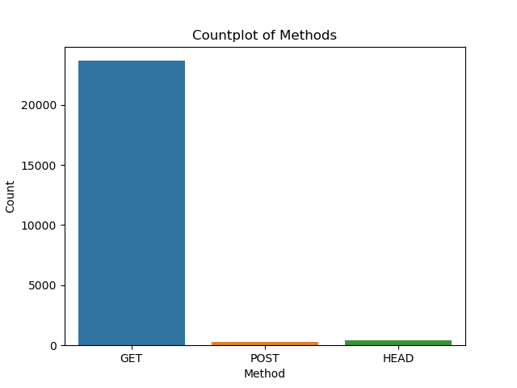
 * <b>Status Codes Distribution </b> 
     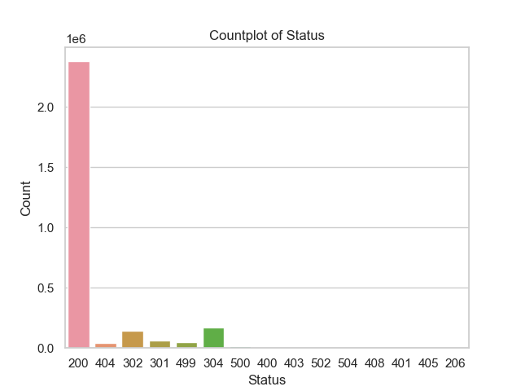
 * <b>User Agent Distribution </b> 
    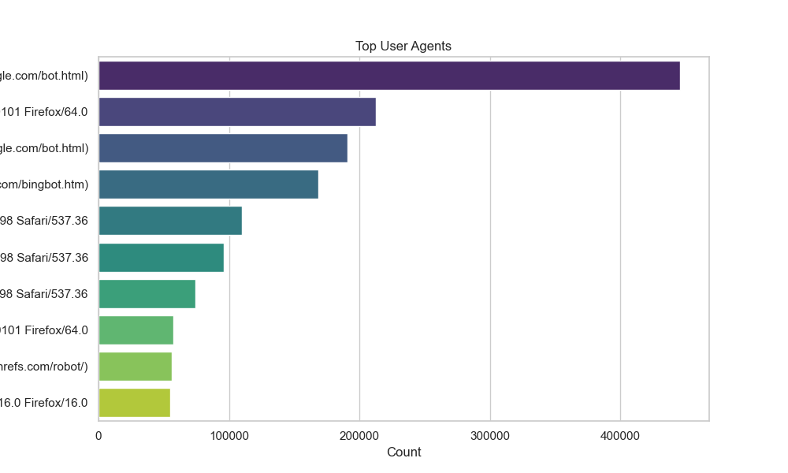
 * <b>Finding outliers</b>  
    Tried to find the unique count of all features to determine if there are any outliers. In that analysis, I observed that 
    the 'User Agent' feature with the browser 'Opera' was only used 2 times in the entire dataset. Further exploration is 
    needed to determine if this is an outlier.
    
  
## Data Preparation

### Data Cleaning
  * Handling Missing Values
  * Parsing Timestamps
  * Finding Error Counts
  * Handling Outliers

## Data Analysis 
### Visitor Analysis
 * Unique Visitors: Count the number of unique IP addresses to estimate the number of unique visitors. 
  Total Unique Visitors: 5298
  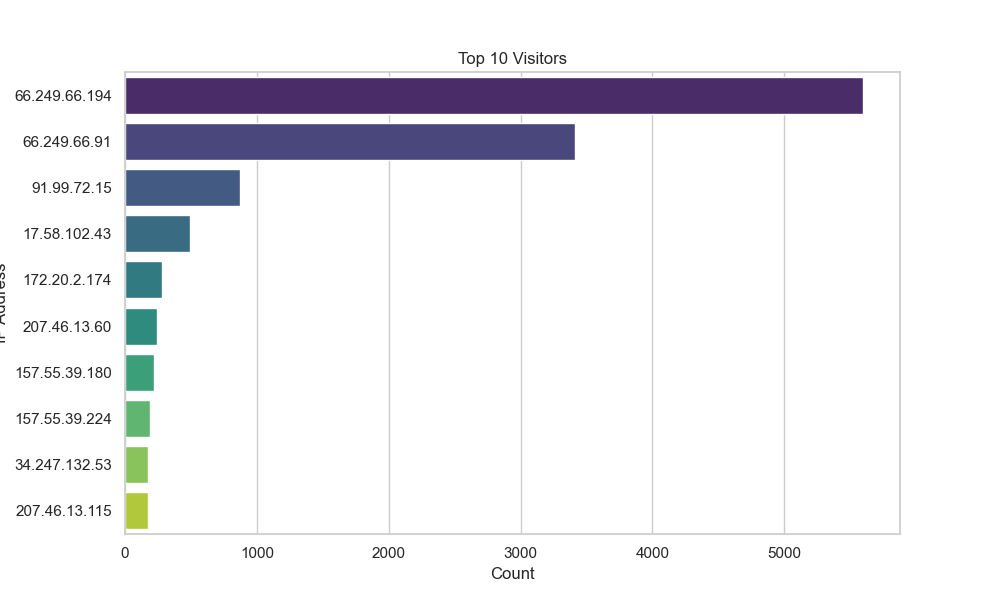
### Behavior Analysis
  * Popular Pages: Identify the most frequently accessed pages (highest count in the "Path" column).
  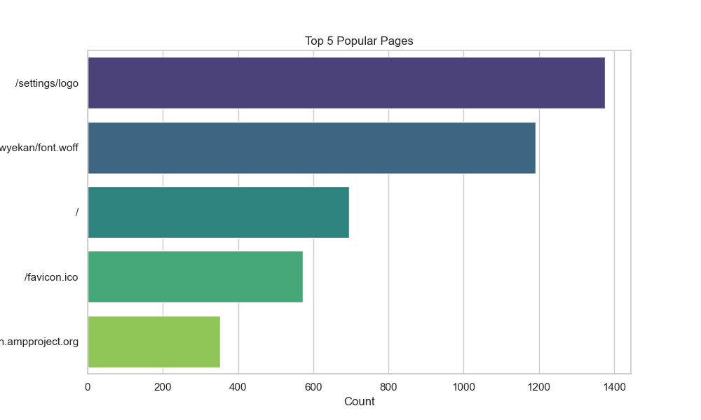
  * Referrer Analysis: Explore the "Referrer" field to understand where visitors are coming from.
  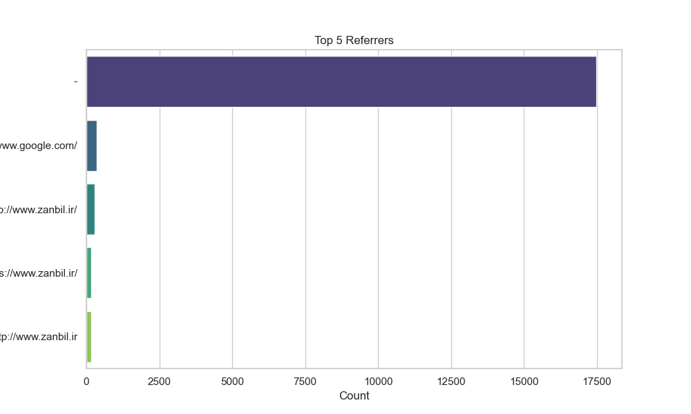
  * User behavior analysis: Provides user activity summary
  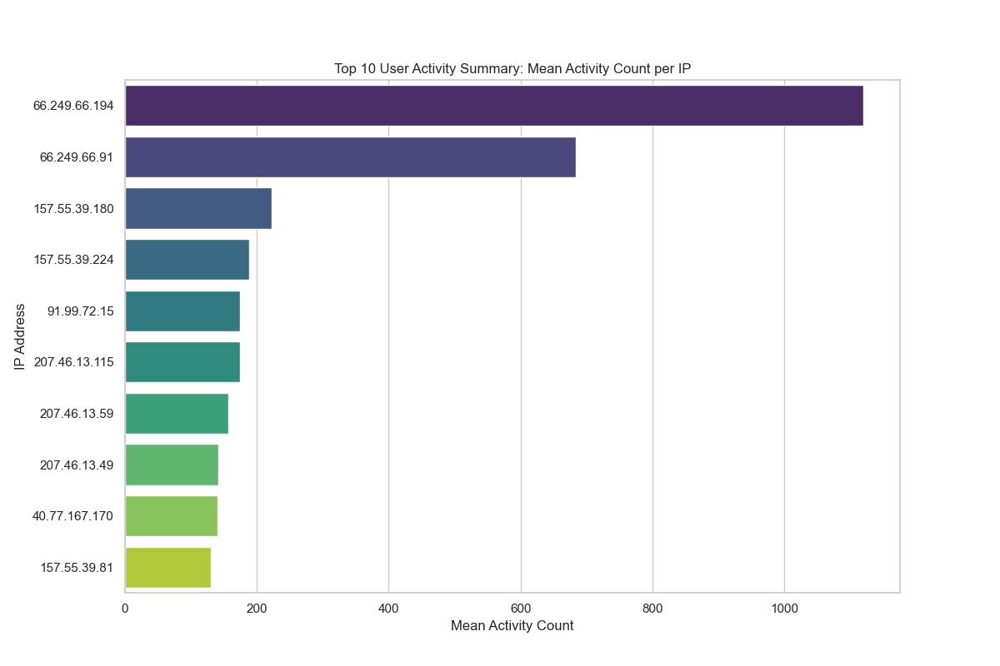
### Crawler Detection
  * Identify Crawlers: Analyze the "User_Agent" field to identify common web crawlers and bots.Check for patterns indicative of  web crawling behavior in the "Path" field.
  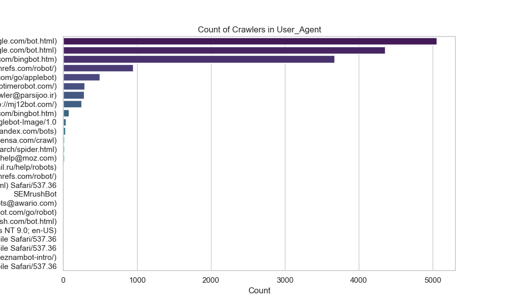
### Security Insights
  * Identify Suspicious Requests: Look for patterns indicative of potential security issues, such as unusual or suspicious requests in the "Path" field.
  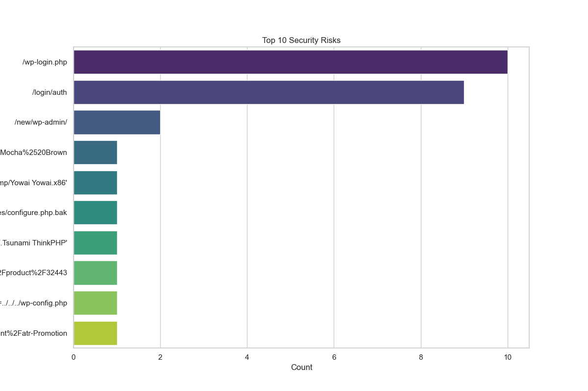
  * Unsuccessful Login Attempts: Identify IP addresses that make frequent unsuccessful login attempts
  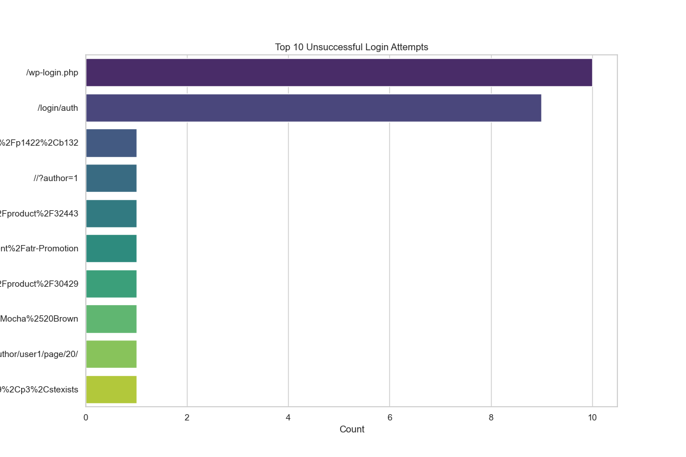
### Business Insights
   * Product Views: If your logs include information about user actions (e.g., purchases), analyze these patterns for business insights. 
   Result: I couldn't find any product views. I'll explore further more
  
## Data Correlation          
* Identifying the Top 10 Features with Positive and Negative Correlations
  
    <b>TOP 10 POSITIVE CORRELATIONS</b> 
    
    IP_104.194.24.33     IP_104.194.24.33     1.000000 
    Referrer_https://ww  Referrer_-           0.955281 
    Path_/m/updateV      Method_POST          0.911948 
    Path_/filter/st      IP_130.185.74.243    0.895064 
    Method_HEAD          Path_/amp_preco      0.885120 
    Method_GET           Method_HEAD          0.858717 
    IP_5.78.198.52       Path_/m/updateV      0.843445 
    Referrer_http://www  IP_63.143.42.246     0.815676 
    Method_POST          IP_5.78.198.52       0.768547 
    Method_GET           Path_/amp_preco      0.760068 

    <b>TOP 10 NEGATIVE CORRELATIONS</b> 

    Path_/filter/p6      IP_66.249.66.194    0.000388 
    Status_301           Referrer_-          0.001247 
    IP_207.46.13.104     Path_/product/1     0.001839 
    IP_66.249.83.7       IP_54.36.148.114    0.002004 
    IP_54.36.149.97      IP_66.249.83.7      0.002004 
    Path_/filter/62      Path_/filter/79     0.002004 
    IP_66.249.83.1       IP_54.36.148.100    0.002004 
    IP_46.229.161.131    Path_/blog/digi     0.002004 
    Path_/m/search?      Path_/browse/sp     0.002004 
    Referrer_http://zan  IP_54.36.148.159    0.002004 
  

## Modeling

### Use Cases

#### Predictive Maintenance
The use case revolves around predicting anomalies or increased errors in a web server based on the rolling error count.This predictive maintenance approach allows proactive identification of potential issues, enabling timely interventions to prevent or minimize downtime and improve the overall reliability and performance of the web server.
#### Anomaly Detection
The use case is anomaly detection in web server logs. Anomalies could represent unusual or potentially malicious activities, and detecting them is crucial for ensuring the security and optimal performance of the web server. The Isolation Forest algorithm is effective in identifying patterns that deviate from the norm, making it suitable for anomaly detection in various contexts, including web server log analysis
#### Security Threat Detection
Web server log security threat detection involves leveraging machine learning, such as RandomForestClassifier, to analyze IP addresses, request paths, and user agents, categorizing requests as normal or suspicious based on predefined patterns,enhancing overall system security
 

### Deployment

## Summary of Models

Background:
The objective is to predict anomalies and security threats from web server log data while also incorporating predictive maintenance measures.

### UseCase1: Predictive Maintenance (Classification Model)

<b>Labeling:</b> It creates a binary label, IncreasedErrors, based on a threshold (RollingErrorCount > 5). If the rolling error count is greater than 5, it's considered an increased error, and the label is set to 1; otherwise, it's 0.

<b>Training a Classifier:</b> It uses the RandomForestClassifier to train a machine learning model. The feature used for prediction is the RollingErrorCount. This model is designed to predict whether an increased error will occur based on the rolling error count.

<b>Pipeline with Imputation and Classifier:</b> It creates a pipeline that includes imputation for handling missing values and the RandomForestClassifier for prediction. The pipeline ensures a streamlined workflow.

<b>Hyperparameter Tuning with GridSearchCV:</b> It performs hyperparameter tuning using GridSearchCV to find the best combination of hyperparameters for both imputation and the classifier. This helps optimize the model's performance.

<b>Evaluation:</b> It splits the dataset into training and testing sets, makes predictions on the test set, and evaluates the model's accuracy and classification report, providing insights into its predictive capabilities.

<b>Results:</b>

Check for Overfitting with Learning Curve

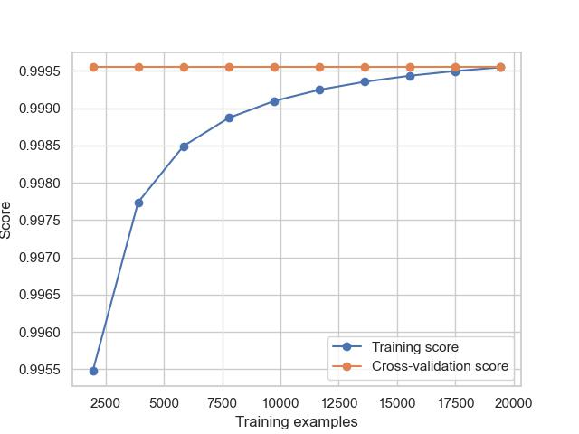

<b>Summary:</b> In the web server log predictive maintenance, the RandomForestClassifier achieved optimal performance with an accuracy of 100%, accurately identifying instances of increased errors. The chosen hyperparameters and imputation strategy further enhanced the precision and recall, ensuring reliable detection of potential anomalies in the log data.

### UseCase2: Anomaly Detection
<b>Feature Extraction:</b> It selects relevant features (Bytes and Status) from the web server log data. These features are chosen for anomaly detection.

<b>Imputation:</b> It uses the SimpleImputer to handle missing values in the selected features. This step is crucial for ensuring that the data is complete before feeding it to the anomaly detection model.

<b>Isolation Forest Model Training:</b> It creates an instance of the Isolation Forest model, a popular algorithm for anomaly detection. The model is trained on the imputed features. The contamination parameter is set to 0.05, indicating the expected proportion of outliers in the data. You may adjust this parameter based on your dataset.

<b>Predict Outliers:</b> It uses the trained model to predict outliers in the features. The predict method assigns a label of 1 to inliers and -1 to outliers.

<b>Adding Outlier Predictions to DataFrame:</b> It adds a new column, IsOutlier, to the original DataFrame, indicating whether each log entry is an outlier (-1) or not (1).

<b>Displaying Anomalies:</b> It filters and displays log entries identified as anomalies (outliers) based on the IsOutlier column.

<b>Results:</b>

Anomalies: 239 entries  
Cross-Validation Average Precision Score: 1.00 
ROC AUC Score: 0.50 

  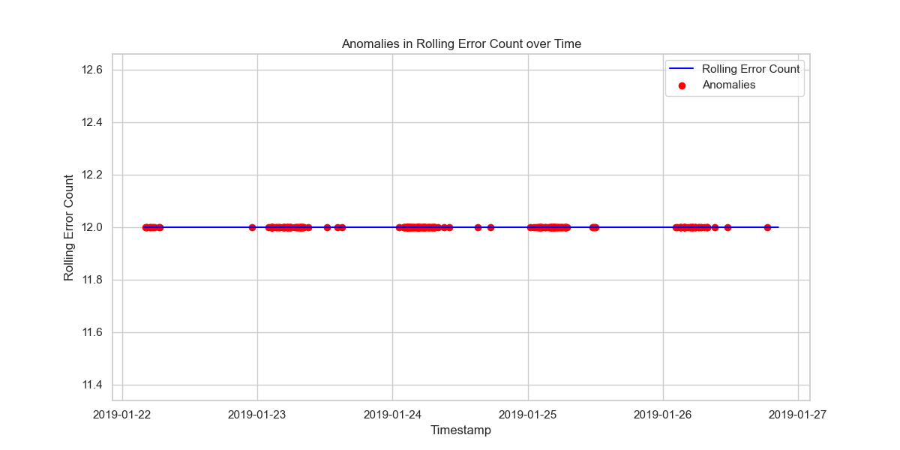 

<b>Summary:</b> These anomalies seem to involve requests with non-standard behavior, such as access to non-existent pages (404 status), unusual user agents (e.g., Googlebot), and potential issues like increased errors. The 'IsOutlier' column indicates whether the entry is considered an anomaly (-1 for anomaly, 1 for normal). The 'Tokens' and 'Text' columns may contain additional information or context.

### UseCase3: Security Threat Detection
   * Tokenization
   * Keyword Extraction
   * Frequency Analysis
   * Bag-of-words approach to vectorize the textual features

<b>Labeling:</b> It creates labels for normal and suspicious requests based on a boolean mask (suspicious_mask) in the 'Label' column.
<b>Data Splitting:</b> The data is split into training and testing sets using train_test_split. Features include 'IP', 'Path', and 'User_Agent', and labels are from the 'Label' column.
<b>Preprocessing:</b> It defines preprocessing for numeric ('IP') and text ('Path', 'User_Agent') features using ColumnTransformer. Numeric features are imputed with a constant and one-hot encoded, while text features are imputed with an empty string and converted to a bag-of-words representation.
<b>Model Training:</b> It creates a machine learning pipeline (Pipeline) with the defined preprocessing and a RandomForestClassifier. The model is then trained on the training data.
<b>Prediction and Evaluation:</b> The trained model is used to make predictions on the test set, and accuracy along with a classification report is printed for model evaluation.

<b>Results</b>

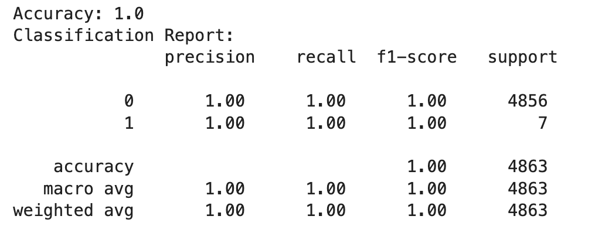

Cross-Validation Accuracy Scores: [1.         1.         0.99974293 1.         1.        ]

Check for Overfitting with Learning Curve

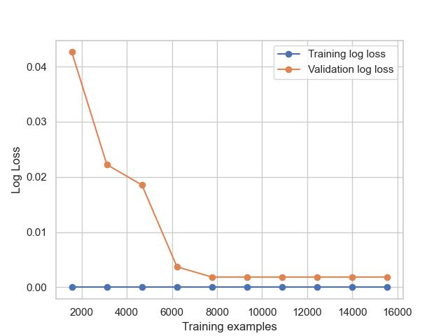

<b>Summary:</b> In the web server log security threat detection, the model achieved perfect accuracy (1.0) on a test set with 4863 entries. It correctly identified normal requests (class 0) and suspicious requests (class 1), demonstrating robust classification performance.

## Recommendations

### Predictive Maintenance

#### Analysis:
* The predictive maintenance model achieved perfect accuracy (1.00).
* All predictions are correctly identifying instances with increased errors (label 1).
#### Recommendations:
* The model seems effective, but it's essential to monitor its performance over time.
* Consider retraining the model periodically to adapt to changing patterns in web server logs.

### Anomalies Detection:

#### Analysis:
Identified 691 anomalies in the web server logs.
Anomalies include non-standard behaviors such as 404 errors, unusual user agents, and increased errors.
#### Recommendations:
Investigate specific patterns and characteristics of anomalies for deeper insights.
Use additional context from 'Tokens' and 'Text' columns to understand the nature of anomalies.
Continuously update and refine anomaly detection based on evolving patterns in web server activities.

### Security Threat Detection:

#### Analysis:
Achieved high accuracy (1.00) in detecting security threats.
The model correctly classified normal (0) and suspicious (1) requests.
#### Recommendations:
Regularly update security patterns to adapt to emerging threats.
Collaborate with cybersecurity experts to enhance the model's ability to identify new security risks.
Periodically review and retrain the model to maintain its effectiveness against evolving threat landscapes.

### General Recommendations:

#### Data Monitoring:
Continuously monitor web server logs for changes in patterns and behaviors.
Set up alerts for sudden spikes in anomalies or security threats.
#### Documentation:
Document and communicate insights gained from each use case to relevant stakeholders.
Maintain a comprehensive record of model performance, anomalies, and security threat detection.

## Conclusion:

The successful implementation of predictive maintenance and effective detection of anomalies and security threats demonstrate the value of data-driven approaches in enhancing web server log analysis. Continued monitoring, periodic model updates, and collaboration with domain experts will contribute to maintaining a robust and adaptive system for web server management and security.

## Link to notebook

https://github.com/priyatamv/capstone/blob/main/log_anlysis.ipynb

## Authors

Priyatam Veyyakula

## Version History

* 0.1
    * Initial Release

